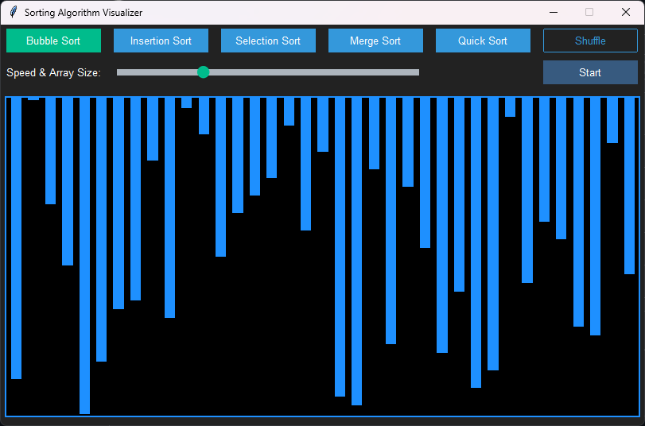

# Sorting Algorithm Visualizer

This project is a **Sorting Algorithm Visualizer** built using Python's `tkinter` library and `ttkbootstrap`. 
The application provides a visual representation of various sorting algorithms in action, allowing users to see how different algorithms work.



## Features
- **Visualization of Sorting Algorithms:**
  - Bubble Sort
  - Insertion Sort
  - Selection Sort
  - Merge Sort
  - Quick Sort
- **Interactive Controls:**
  - Shuffle the array.
  - Adjust array size and sorting speed with a slider.
  - Start sorting with a selected algorithm.
- **Real-time Visualization:**
  - Animations display element comparisons and swaps.
  - Colors represent the current state of the sorting process.

---

## Getting Started

### Prerequisites
- Python 3.7 or higher
- Install the required libraries:
  ```bash
  pip install numpy ttkbootstrap==0.5.1
  ```

## How It Works

### Sorting Algorithms
- **Bubble Sort:** Repeatedly swaps adjacent elements if they are in the wrong order.
- **Insertion Sort:** Builds a sorted array one element at a time by inserting elements into their correct position.
- **Selection Sort:** Finds the smallest element and places it at the beginning, iterating through the list.
- **Merge Sort:** Divides the array into halves, recursively sorts them, and merges the sorted halves.
- **Quick Sort:** Partitions the array into two sections and sorts them recursively.

### Visualization
- **Canvas:** Displays the array as vertical bars whose heights represent the array elements.
- **Colors:**
  - **Default:** Blue
  - **Comparing elements:** Yellow
  - **Swapping elements:** Red
  - **Sorted elements:** Green

## Acknowledgments
- Built with Python's `tkinter` and `ttkbootstrap` for a modern UI.
- Inspired by Coding with Lewis and this [video](https://www.youtube.com/watch?v=rbbTd-gkajw)
